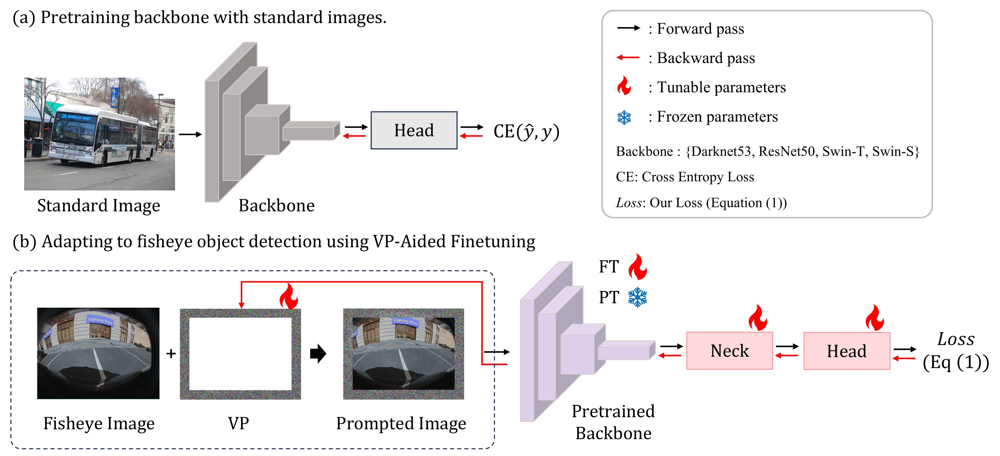
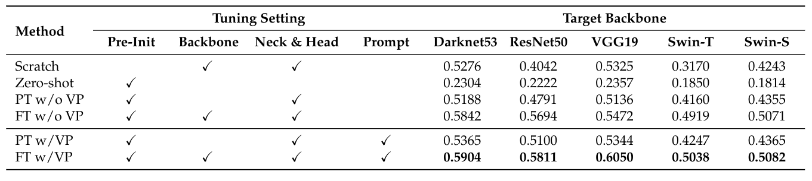

# Fisheye Object Detection with Visual Prompting-Aided Fine-tuning

A guide of Pytorch implementation of "[Fisheye Object Detection with Visual Prompting-Aided Finetuning](https://www.mdpi.com/2076-3417/12/9/4288)" (remote sensing).

### Abstract
> Fisheye cameras play a crucial role in various fields by offering a wide field of view, enabling the capture of expansive areas within a single frame.
Nonetheless, the radial distortion characteristics of fisheye lenses lead to notable shape deformation, particularly at the edges of the image, posing a significant challenge for accurate object detection.
In this paper, we introduce a novel method, `VP-aided fine-tuning', which harnesses the strengths of the pretraining--fine-tuning paradigm augmented by visual prompting (VP) to bridge the domain gap between undistorted standard datasets and distorted fisheye image datasets.
Our approach involves two key elements: the use of VPs to effectively adapt a pretrained model to the fisheye domain, and a detailed 24-point regression of objects to fit the unique distortions of fisheye images.
This 24-point regression accurately defines the object boundaries and substantially reduces the impact of environmental noise.
The proposed method was evaluated against existing object detection frameworks on fisheye images, demonstrating superior performance and robustness. 
Experimental results also showed performance improvements with the application of VP, regardless of the variety of fine-tuning method applied.

### Architecture


### Experiments
#### Benchmark
  
#### Qualitative results


## Usage

### Environment
- Ubuntu 18.04.6 LTS
- Python 3.9.16
- Pytorch 2.0.1

### Pretrained Backbone
Based on YOLOX-l, we replace the original backbone in YOLOX (YOLOX-Darknet53) with VGG19, ResNet50, and DenseNet121 respectively.
Download Backbone pretrained weight at 'https://github.com/IN2-ViAUn/Exploration-of-Potential'

### Dataset
Download WoodScape dataset at 'https://woodscape.valeo.com/woodscape/download'

### Dataset Preprocessing
```bash
$ cd datasets
$ python 2_24_labels_create_wood.py 
```

### Train

```bash
$ python train_24p.py -f load_train/yolox_24p_train.py -b 20 -l 0.0001 
```

### Get 24 point output

```bash
$ python get_iou.py -f load_eval/yolox_24p_eval.py -w {model_weight}.pt -p {validation image path} -w_p {prompt_weight}.pt
```
### Get IOU

```bash
$ python get_iou.py -f load_eval/yolox_24p_eval.py -w {model_weight}.pt -w_p {prompt_weight}.pt
```


## Citation
If you use this code in your paper, please consider citing this ```BibTeX``` entry.
```
@article{jeon2024fisheye,
  title={Fisheye Object Detection with Visual Prompting-Aided Fine-Tuning},
  author={Jeon, Minwoo and Park, Gyeong-Moon and Hwang, Hyoseok},
  journal={Remote Sensing},
  volume={16},
  number={12},
  pages={2054},
  year={2024},
  publisher={MDPI}
}
```